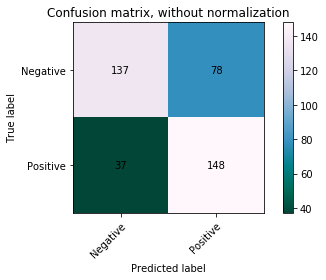
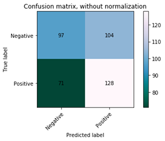

# Positivity and social media
Internet users often debate on why their preferred social media stands out from the rest. Objectively speaking, a good way of determining the best one is  through  the  procedure  of  sentiment  analysis. This process consists of measuring the degree of positivity of a given set of comments.

The main focus here is to be able to train a model on a Twitter data set, and predict the level of positivity for a set of data from Reddit. As a result, the best positive social media between these two will be decided.

The resultant models will vary in their classifying approaches to see how differently they perform. Comments from Twitter will be gathered from an existing data set to train these models. Moreover, to obtain a better insight on the performance of the models, size of the training set will be modified.

<!-- TABLE OF CONTENTS -->
## Table of Contents

* [Features](#Features)
* [Tech/framework used](#Tech/framework-used)
* [Installation](#Installation)
  * [Run the Jupiter Notebooks](#Run-the-Jupiter-Notebooks)
  * [Libraries needed](#Libraries-needed)
* [Code Example](#Code-Example)
* [Results](#Results)
* [Conclusions](#Conclusions)
* [Credits](#Credits)
* [Contacts](#contacts)

## Features
* Sentiment Analysis of Twitter and Reddit datasets
* Two different type of classifiers : SVM and Multinomial Naive Bayes
* Stemming and Lemmatisation
* Word2vec and BOW model implementation


## Tech/framework used
* [Jupiter Notebook](https://jupyter.org)
* [Python](https://www.python.org)
* [Google Colab](https://colab.research.google.com)

## Installation
### Run the Jupiter Notebooks

Run the following code in the console
```
ipython nbconvert --to python <NotebookName>.ipynb
```
or download the repository and run it in local.

### Libraries needed

```
pip3 install nltk
pip3 install pandas
pip3 install gensim
pip3 install seaborn
```


## Code Example
**1. Importing the training dataset**
```python
###Import the training data from file
df_train = pd.read_csv('TrainingTwitterFinal20K.csv')
df_train.dropna(axis=0, inplace=True)
```
**2. Cleaning the sentences**
```python
###Apply clean to the train data
df_train['comment'] = df_train['comment'].apply(clean)
```
**3. Transforming the sentences in Word2Vec or BOW model**
```python
vectorizer = CountVectorizer()
sentenceVectors = vectorizer.fit_transform(allSentences)

tfidf = TfidfTransformer()
train = tfidf.fit_transform(sentenceVectors)
```
**4. Building the classifier**
```python
###create a Multinomial Naive Bayes Classifier, input array for X values and labels s
clf = MultinomialNB().fit(train, labels)
```
**5. Importing the test dataset**
```python
###Retrieving the test data
df_test = pd.read_csv('400PosTestReddit.csv')
```
**6. Predicting the labels of the test data with the classifier**
```python
###calculate accuracy of the classifier
predicted = clf.predict(sentenceVectors2)

np.mean(predicted == labels)

Output: 0.8325
```
## Results
Tests were carried out for both models with varying sizes in the training data. 

**SVM accuracy** 

| Training set size | Accuracy |
|-------------------:|:----------:|
| 20000             | 0.5625   |
| 50000             | 0.5125   |
| 100000            | 0.5100   |

**Naive Bayes accuracy** 

| Training set size | Accuracy |
|-------------------:|:----------:|
| 20000             | 0.7125   |
| 50000             | 0.6500   |
| 100000            | 0.6275   |


#### Multinomial Naive Bayes

<br/>
Heatmap representing coefficient matrix of the model’s performance when the training set is of size 20000

#### SVM

<br/>
Heatmap representing coefficient matrix of the model’s performance when the training set is of size 20000

## Conclusions

It is observable from the SVM tests that all accuracy, precision and recall are inversely proportional to the size of the training data. The reason behind this could be due to the fact that training data is exclusively done on Twitter comments. The more comments are trained, the higher the difference in word vectors with respect the test data. This suggests that Reddit comments are very different from the Twitter ones, and therefore these parameter significantly decrease.

Based on section Multinomial Naive Bayes, accuracy, precision and recall are inversely proportional to the size of the training set. 
Moreover, it can be concluded that the Naive Bayes model performs significantly better than the SVM model. This is because Multinomial performs better with short comments.
It is observable that for both true labels and predicted labels, Reddit is a more negative social media compared to Twitter. Therefore it can be concluded that Twitter is the best choice for a social media.

## Credits
* [Twitter sentiment classification using distant supervision](https://www-cs.stanford.edu/people/alecmgo/papers/TwitterDistantSupervision09.pdf)
* [Target-dependent  twitter  senti-ment classification](https://www.aclweb.org/anthology/P11-1016)
* [Baselines and Bigrams: Simple, Good Sentiment and Topic Classification](https://www.aclweb.org/anthology/P12-2018)
* [Scikit-learn](https://github.com/scikit-learn/scikit-learn)

## Contacts
* Carlos Abril
* G**iu**seppe Marinelli


